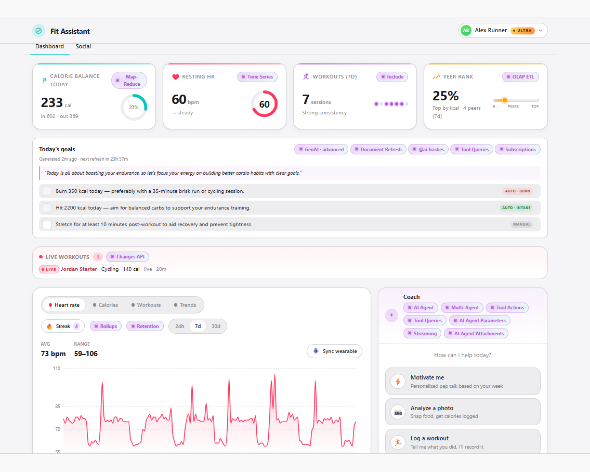
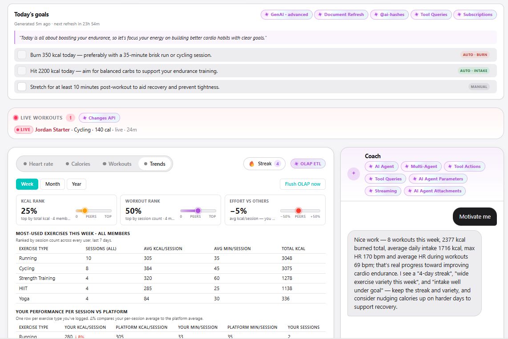
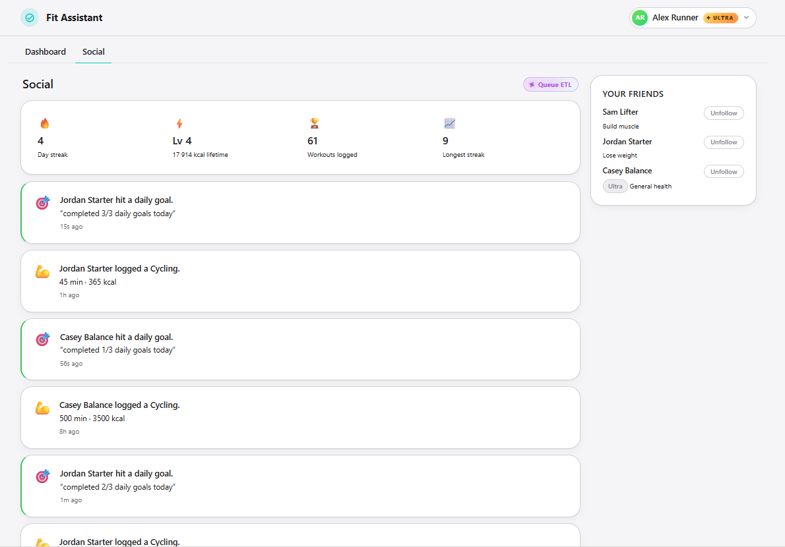

# Fit Assistant


## Overview

A sample application showing how a fitness / health domain maps onto [RavenDB](https://ravendb.net): daily AI-generated goals, an AI chat coach with photo-based food logging, real-time activity feed across friends, heart-rate time series with rollups, and a Parquet/DuckDB trends pipeline.



## Features used

The following RavenDB features power this application:

1. [AI Agents](https://docs.ravendb.net/ai-integration/ai-agents/ai-agents_overview): the parent chat agent plus four sub-agents (motivate, explain-workout, food-photo-analyzer, calorie-estimator), with conversation persistence in `@conversations`, attachments, and streaming.
1. [GenAI Tasks](https://docs.ravendb.net/ai-integration/ai-agents/creating-ai-agents/creating-ai-agents_api): `daily-goals` (per-user, scheduled via `@refresh`) and `auto-coach` (per-workout) producing structured output deduped via `@ai-hashes`.
1. [Time Series](https://docs.ravendb.net/document-extensions/timeseries/overview) + [Rollups](https://docs.ravendb.net/document-extensions/timeseries/rollup-and-retention): heart-rate data with raw / hourly / daily / monthly tiers; queries pick the tier that matches the range.
1. [Subscriptions](https://docs.ravendb.net/client-api/data-subscriptions/what-are-data-subscriptions): auto-fulfill goals when activity crosses their threshold; fan fulfilled-goal events out to friends.
1. [Queue ETL](https://docs.ravendb.net/server/ongoing-tasks/etl/queue-etl/rabbitmq-etl): RabbitMQ-backed per-follower activity feed delivery.
1. [OLAP ETL](https://docs.ravendb.net/server/ongoing-tasks/etl/olap-etl): Parquet partitions to MinIO, read by embedded DuckDB for the trends tab.
1. [Changes API](https://docs.ravendb.net/client-api/changes/what-are-changes): the live-workouts ticker is push-driven, no polling.
1. [Document Refresh](https://docs.ravendb.net/studio/database/settings/document-refresh) + [Expiration](https://docs.ravendb.net/studio/database/settings/document-expiration): scheduled heartbeats trigger the daily-goals task; old goal docs self-prune.





## Technologies

1. RavenDB 7.2
1. .NET 10
1. ASP.NET Core 10
1. Node.js 22
1. React 18 + TypeScript
1. .NET Aspire 13
1. DuckDB (embedded)
1. MinIO (S3-compatible object store)
1. RabbitMQ

## Run locally

### Prerequisites

1. [.NET 10 SDK](https://dotnet.microsoft.com/en-us/download/dotnet/10.0)
1. [Aspire](https://learn.microsoft.com/en-us/dotnet/aspire/cli/overview)
1. [Node.js 22 or newer](https://nodejs.org/en/download)
1. [Docker Desktop](https://www.docker.com/products/docker-desktop/)

### Run

Install frontend dependencies once:
```bash
cd src/FitAssistant.Frontend && npm install
```


From the repo root:

```bash
aspire run
```


### Configure secrets

| Parameter | Description                                             |
|---|---------------------------------------------------------|
| `openai-api-key` | Get one from the OpenAI API platform                    |
| `ravendb-license` | Get free developer license from https://ravendb.net/dev |

Provide via:
1. **Aspire dashboard, Parameters tab.** Paste the value at runtime; Aspire persists it to user-secrets so subsequent runs reuse it.
2. **User-secrets.** Set them once via the .NET CLI:
   ```bash
   cd samples.fit-assistant
   dotnet user-secrets set "Parameters:openai-api-key"  "<your-openai-key>"  --project src/FitAssistant.AppHost
   dotnet user-secrets set "Parameters:ravendb-license" '<your-license-json>' --project src/FitAssistant.AppHost
   ```

## Community & Support

If you spot a bug, have an idea, or a question, please open an issue.

We also use a [Discord server](https://discord.gg/ravendb). If you have any doubts, don't hesitate to reach out!

## License

This project is licensed with the [MIT license](LICENSE).
